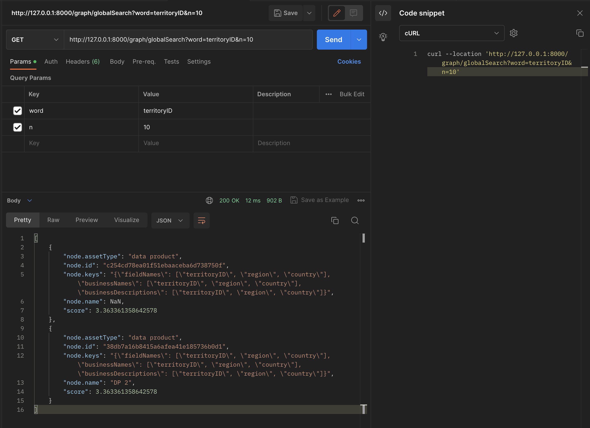

# Global Search

## Dependencies

The following will be primarily targeted for MacOS, with the assumption that Anaconda is already installed on the machine.

First, create a virtual environment with conda (replace "myenv" with desired name) and activate it:
```zsh
conda create -n myenv python=3.10.9
conda activate myenv
```

Next, install the following packages from `requirements.txt` with pip:
```zsh
pip install -r requirements.txt
```

## Installing Neo4j

For local machine, follow the instructions in `neo4j-local.md`:

For EC2 instance, follow the instructions in `neo4j-ec2.md`:

## API Usage

The main components that the API uses are in `src` folder, with `flask_app.py` being the primary file to run 

To run, first activate the env created above 
```python
conda activate myenv
```
and navigate to the `src` folder and run:
```zsh
python flask_app.py
```

If you would like to run the server in the background, use nohup:
```zsh
chmod +x flask_app.py
nohup flask_app.py &
```

This will start the server on http://127.0.0.1:8000.

You can then use the api either directly through curl or import to postman:

### Global search (GET)
```zsh
curl --location 'http://127.0.0.1:8000/graph/globalSearch?word=territoryID&n=10'
```

**RESPONSE**:
```json
[
    {
        "node.assetType": "data product",
        "node.id": "c254cd78ea01f51ebaaceba6d738750f",
        "node.keys": "{\"fieldNames\": [\"territoryID\", \"region\", \"country\"], \"businessNames\": [\"territoryID\", \"region\", \"country\"], \"businessDescriptions\": [\"territoryID\", \"region\", \"country\"]}",
        "node.name": NaN,
        "score": 3.363361358642578
    },
    {
        "node.assetType": "data product",
        "node.id": "38db7a16b8415a6afea41e185736b0d1",
        "node.keys": "{\"fieldNames\": [\"territoryID\", \"region\", \"country\"], \"businessNames\": [\"territoryID\", \"region\", \"country\"], \"businessDescriptions\": [\"territoryID\", \"region\", \"country\"]}",
        "node.name": "DP 2",
        "score": 3.363361358642578
    }
]
```



The example above searches for the term `territoryID` and limits the output to `10` results maximum.

### Insert / Update Node (POST)
```zsh
curl --location 'http://127.0.0.1:8000/graph/globalSearch' \
--header 'accept: application/json' \
--header 'Content-Type: application/json' \
--data '{"id": "e73e30222cd0ed412a79a0804ecd38f1", "name": "testAPI", "assetType": "data product", "keys": {"fieldNames": ["territoryID", "region", "country"], "businessNames": ["territoryID", "region", "country"], "businessDescriptions": ["territoryID", "region", "country"]}}'
```

**RESPONSE**:
```json
{
  "NEW NODE": "inserted node with id e73e30222cd0ed412a79a0804ecd38f1 and asset type data product"
}
```

OR

```json
{
  "EXISTS": "updated node with id e73e30222cd0ed412a79a0804ecd38f1 and asset type data product"
}
```


The example above either inserts or updates a node. It takes in the request body a json that requires the fields `id, name, assetType, keys` where `keys` can be a json of key-value pairs as seen above. The response is determined based on if the node id and assetType already exist in the database.

### Delete Node (DELETE)
```zsh
curl --location --request DELETE 'http://127.0.0.1:8000/graph/globalSearch?id=e73e30222cd0ed412a79a0804ecd38f1&assetType=data%20product'
```

**RESPONSE**
```json
{
    "DELETE": "Deleted node with id e73e30222cd0ed412a79a0804ecd38f1 and assetType data product"
}
```

OR 

```json
{
    "ERR": "No node with id e73e30222cd0ed412a79a0804ecd38f1 and assetType data product found"
}
```


The example above deletes the node based on id and assetType (in this case id of `e73e30222cd0ed412a79a0804ecd38f1` and assetType `data product`). If the node doesn't exist, we recieve the second response above.